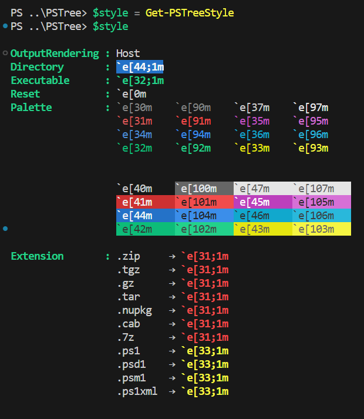
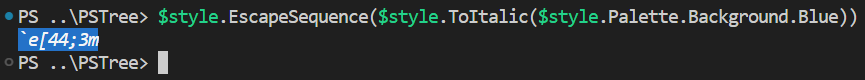

# about_TreeStyle

## SHORT DESCRIPTION

Describes the available support for ANSI escape sequences in PSTree Module.

## LONG DESCRIPTION

PSTree v2.2.0 adds support for coloring the hierarchy output from `Get-PSTree` cmdlet via the `TreeStyle` type. The type offers a subset of capabilities that the built-in [`PSStyle`][1] has, more specifically, the [`FileInfoFormatting`][2] subset.

The instance of this type can be accessed via the [`Get-PSTreeStyle`][3] cmdlet or the `[PSTree.Style.TreeStyle]::Instance` property:

<div>
  &nbsp;&nbsp;&nbsp;
  
</div>

It has some useful methods to combine escape sequences as well as add accents, see next section for more details.

```powershell
   TypeName: PSTree.Style.TreeStyle

Name            MemberType Definition
----            ---------- ----------
CombineSequence Method     string CombineSequence(string left, string right)
Equals          Method     bool Equals(System.Object obj)
EscapeSequence  Method     string EscapeSequence(string vt)
GetHashCode     Method     int GetHashCode()
GetType         Method     type GetType()
ResetSettings   Method     void ResetSettings()
ToBold          Method     string ToBold(string vt)
ToItalic        Method     string ToItalic(string vt)
ToString        Method     string ToString()
Directory       Property   string Directory {get;set;}
Executable      Property   string Executable {get;set;}
Extension       Property   PSTree.Style.Extension Extension {get;}
OutputRendering Property   PSTree.Style.OutputRendering OutputRendering {get;set;}
Palette         Property   PSTree.Style.Palette Palette {get;}
Reset           Property   string Reset {get;}
```

The `EscapeSequence()` method can be used to see the escape sequence used to produce the color and accent, for example:

<div>
  &nbsp;&nbsp;&nbsp;
  
</div>

## CUSTOMIZING OUTPUT

Similar to `PSStyle` you can update the properties of `TreeStyle` as well as add an remove coloring for different extensions.

> [!NOTE]
>
> - For now, customizing the output of files that are a __SymbolicLink__ is not supported.
> - The __Executable__ accent is only available for Windows Operating System.

For example, take the standard output:

<div>
  &nbsp;&nbsp;&nbsp;
  
</div>

We can make a few changes to the style object:

```powershell
$style = Get-PSTreeStyle
$palette = $style.Palette
# update the .ps1 extension
$style.Extension['.ps1'] = $style.CombineSequence($palette.Foreground.White, $palette.Background.Red)
# add the .cs extension
$style.Extension['.cs'] = $style.ToItalic($style.ToBold($palette.ForeGround.BrightCyan))
# update the Directory style
$style.Directory = "`e[45m"
```

> [!TIP]
>
> - The `` `e `` escape character was added in PowerShell 6. __Windows PowerShell 5.1__ users can use `[char] 27` instead, for example from previous example, instead of ``"`e[45m"`` you can use `"$([char] 27)[45m"`.
 See [__about_Special_Characters__][4] for more details.
> - The `TreeStyle` type has 3 public methods that you can use to add accents or combine VT sequences, `ToItalic()`, `ToBold()` and `CombineSequence()`.
> - You can also reset the style instance to its initial state using `.ResetSettings()` however if you had the instance stored in a variable you will need to re-assign its value, i.e.: `$style.ResetSettings()` then `$style = treestyle`.

Then, if we re-run the same command we can see those changes in the PSTree output:

<div>
  &nbsp;&nbsp;&nbsp;
  
</div>

## DISABLING ANSI OUTPUT

Similarly to `PSStyle`, you can disable the ANSI rendering by updating the `OutputRendering` property:

```powershell
(Get-PSTreeStyle).OutputRendering = 'PlainText'
```

[1]: https://learn.microsoft.com/en-us/powershell/module/microsoft.powershell.core/about/about_ansi_terminals
[2]: https://learn.microsoft.com/en-us/dotnet/api/system.management.automation.psstyle.fileinfoformatting
[3]: ./Get-PSTreeStyle.md
[4]: https://learn.microsoft.com/en-us/powershell/module/microsoft.powershell.core/about/about_special_characters?view=powershell-7.4
